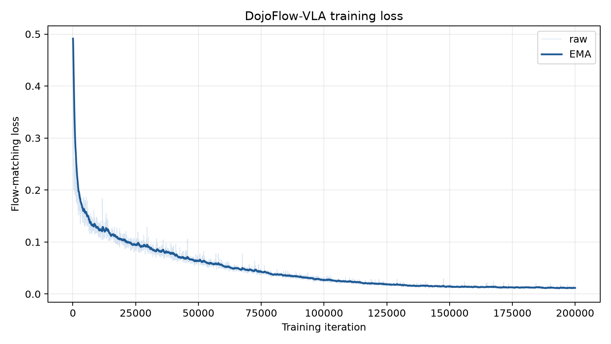
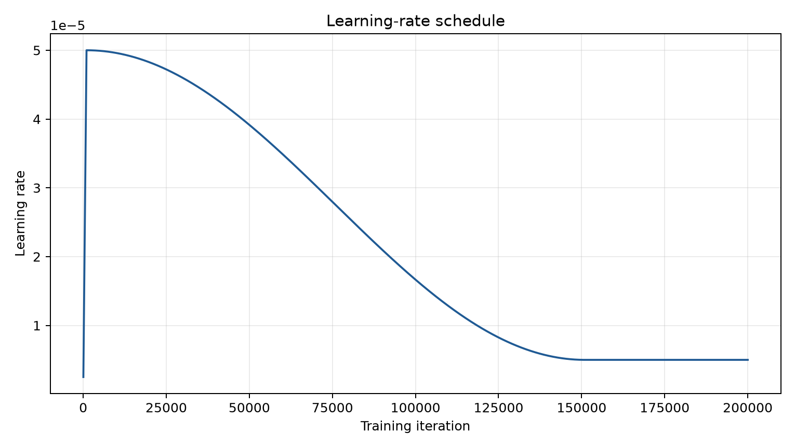
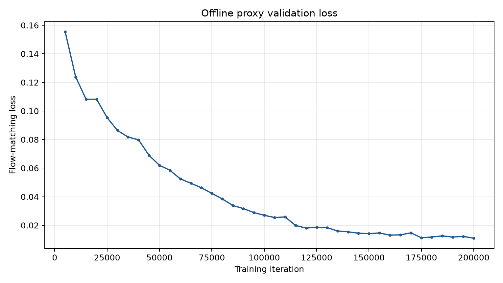
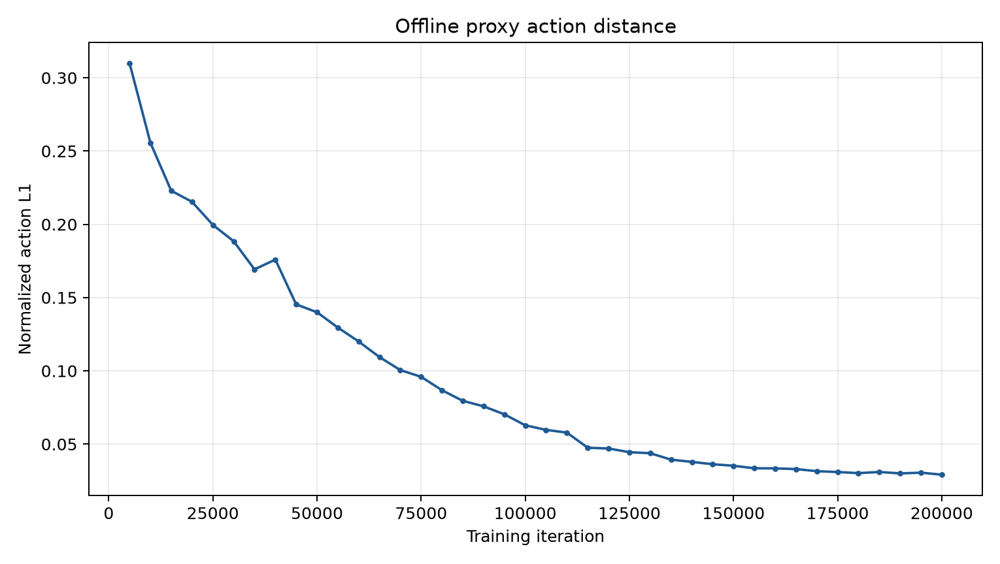

# 实验结果

## 当前可公开材料

- 200,000 step 训练配置；
- W&B run ID：`2plm476a`；
- 5k 间隔的离线动作误差图；
- 10k 间隔 checkpoint；
- 最终模型与 norm stats 校验清单。

## 离线训练摘要

| 指标 | 5k | 200k | 变化 |
|---|---:|---:|---:|
| proxy `val/loss` | 0.155449 | 0.010975 | -92.94% |
| proxy `val/angle dist` | 0.309909 | 0.029146 | -90.60% |

在 40 个 5k 间隔验证点中，200k 点同时取得最低 proxy validation loss 和最低归一化
动作 L1。由于数据来自训练 dataloader，这只能说明监督目标拟合和训练稳定性，不能据此
宣称任务成功率。

## 指标解释

- `train/loss`：训练流匹配损失；
- `val/loss`：训练 dataloader 抽样上的流匹配损失；
- `val/angle dist`：归一化动作平均 L1 距离，名称虽含 angle，但覆盖全部动作维度；
- `val/distance_breakdown`：按 25 个 chunk 和 20 个动作维度拆解的 L1 距离。

这些指标是离线代理，不是 RoboDojo 成功率。

## Generalization 本机冒烟结果

step-199999、`action_type=ee`；成功覆盖口径包含补充 seed 中观察到的成功：

| 指标 | 全部 | 标准配置 | Random 配置 |
|---|---:|---:|---:|
| Runner 完成 | 24/24 | 12/12 | 12/12 |
| 二元成功覆盖率 | 12.50%（3/24） | 25.00%（3/12） | 0%（0/12） |
| 原始 seed 0 `score` 简单平均 | 11.67 | 21.25 | 2.08 |

二元成功覆盖任务为 `fold_clothes`、`stack_bowls` 与 `pour_liquid_into_cup`；第三项来自
补充 seed 1。逐配置机器可读数据见
`metrics/evaluation_results.csv`，解释与风险见 `docs/冒烟测试报告.md`。

### `pour_liquid_into_cup` 多 seed 补充

标准配置在资源实际提供的 seed 0/1/2 上分别得到 0、100、0 分，即 1/3 二元成功、
平均分 33.33。该结果单独记录在 `metrics/pour_liquid_3seed_results.csv`，并按当前报告
采用的“每配置是否曾观察到成功”口径计入 `3/24` 成功覆盖。

### `pack_objects_into_box` 标准与 random 多 seed 补充

标准配置在 seed 0/1/2 上分别为 50、0、25 分，三 seed 平均 25.00；random 配置分别为
25、0、25 分，三 seed 平均 16.67。两种配置均为 0/3 二元成功，结果记录在
`metrics/pack_objects_into_box_3seed_results.csv`。

## 正式结果待回填

主办方工作人员仍在执行正式初赛评测，预计无法在本次复杂材料提交截止前完成。因此当前
提交版本中的官方总分、各任务/seed 汇总、有效 episode 数和评测时间均为占位内容，不用
本机冒烟结果冒充。收到结果邮件后再替换占位并记录受控存档位置。

| 正式结果字段 | 当前提交值 |
|---|---|
| 官方总分 | 占位（主办方评测进行中） |
| 各任务/seed 汇总 | 占位（主办方评测进行中） |
| 有效 episode 数 | 占位（主办方评测进行中） |
| 正式评测时间 | 占位（主办方评测进行中） |
